# NELC Design System

A structured design system for NELC covering brand identity, reusable components, foundations, and ready-to-use templates.

---

## Branding

### Logos

  

  
  

---

### Icons

#### Filled Icons

  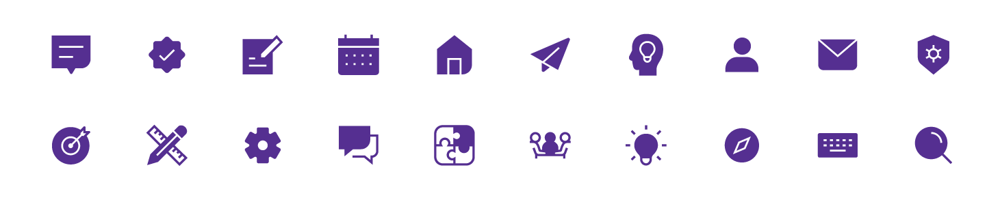

#### Outline Icons

  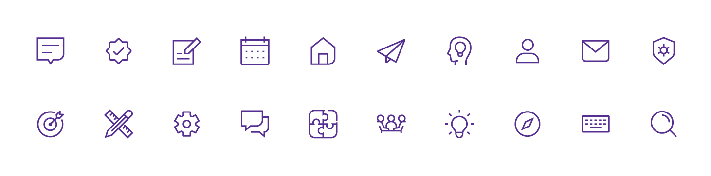

---

### Sub-Logos

  
  
  

  
  
  

---

## Components

### Buttons

  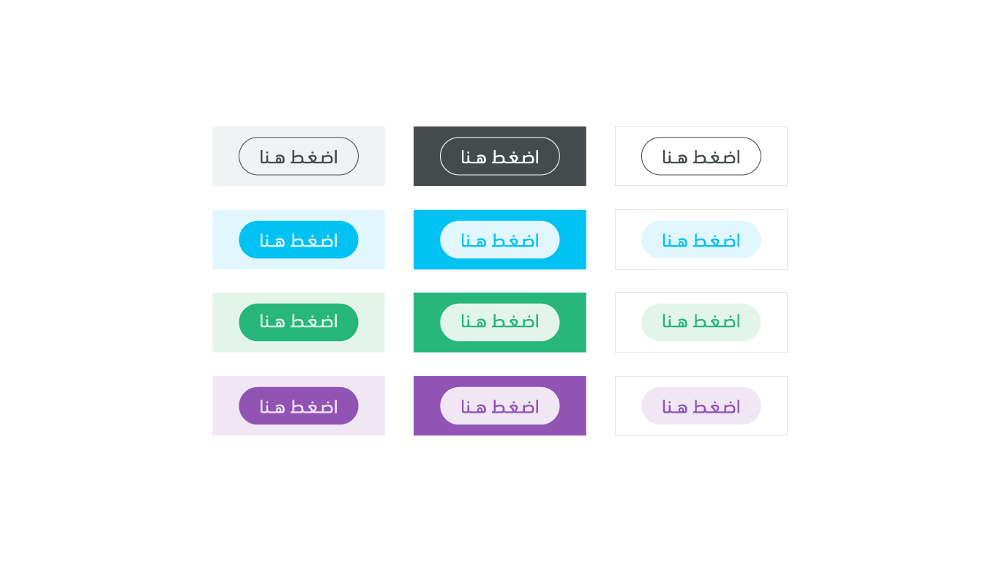

---

### Footer

  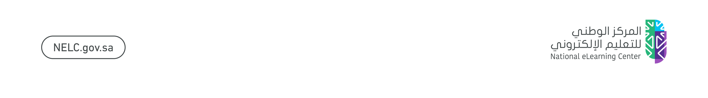
  

  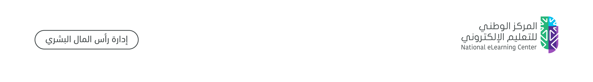
  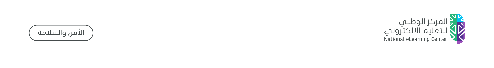

---

## Foundations

  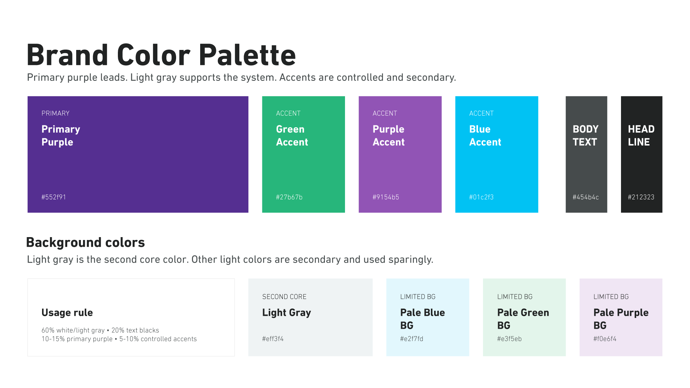
  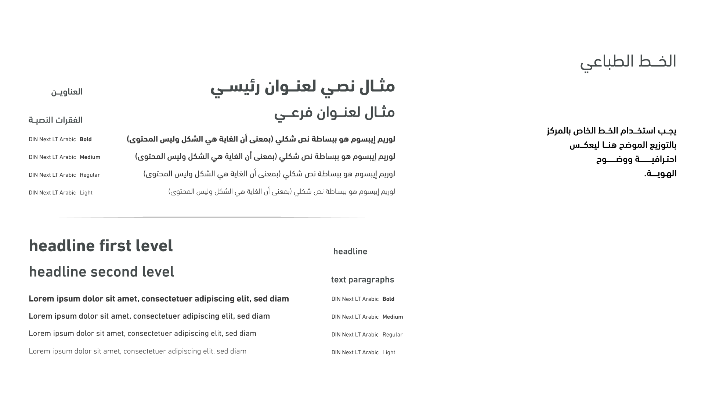

---

## Templates

### Portrait 4:5

  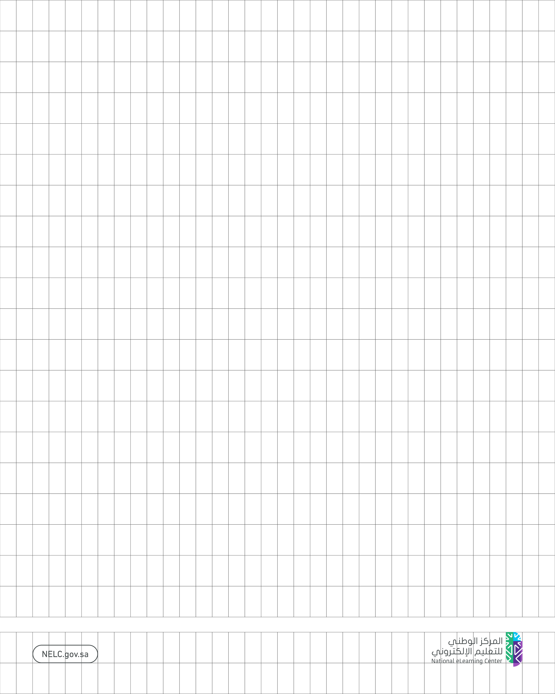
  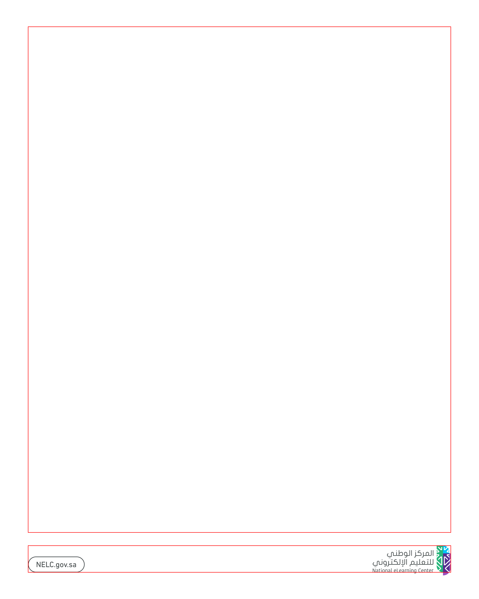
  

---

### Square 1:1

  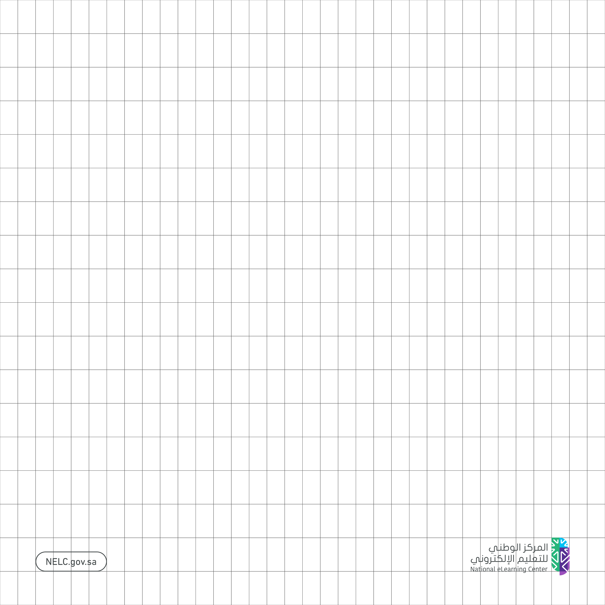
  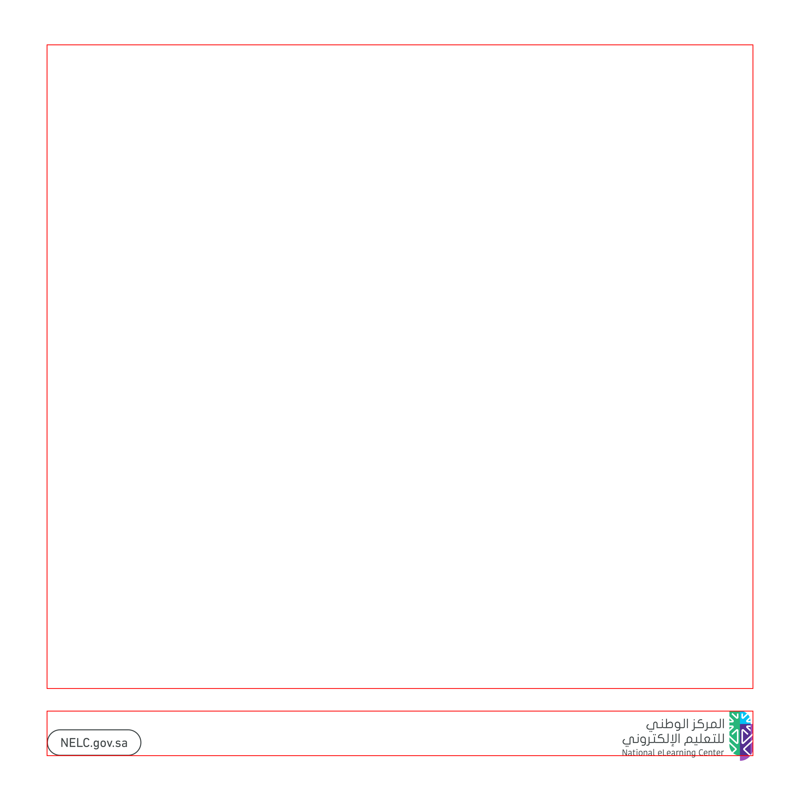
  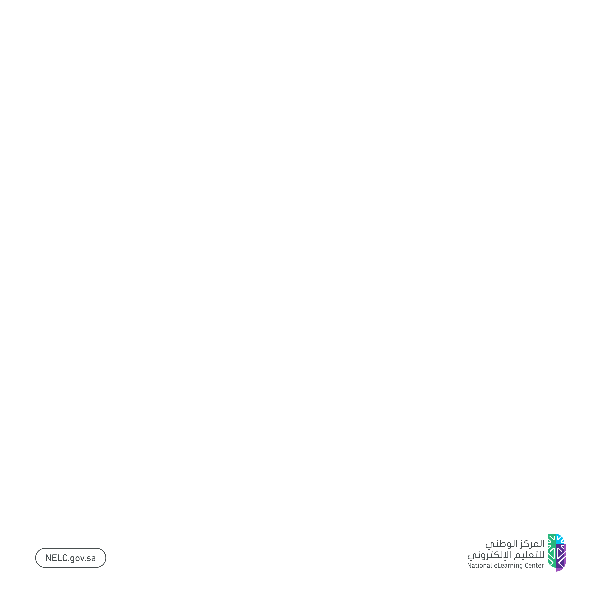

---

### Landscape 2:1

  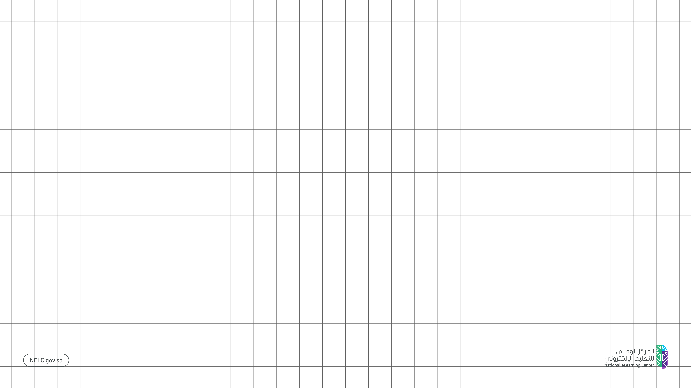
  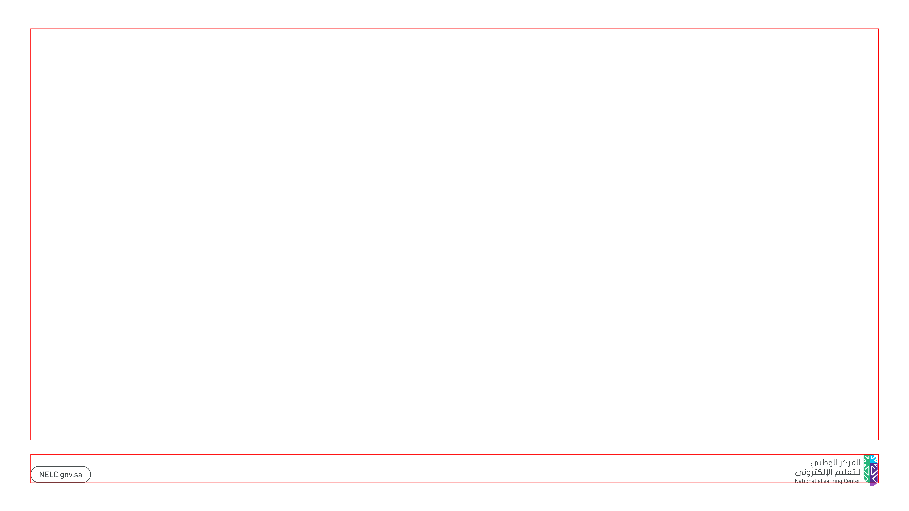
  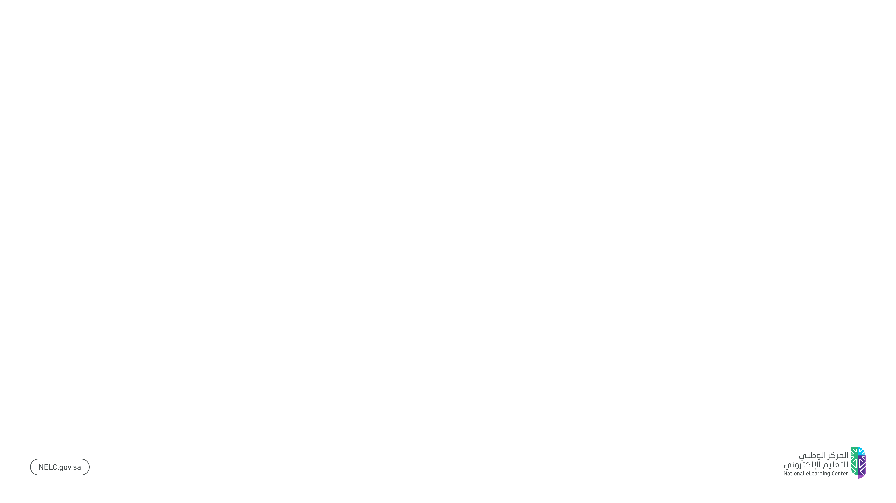

---

### Reels 9:16

  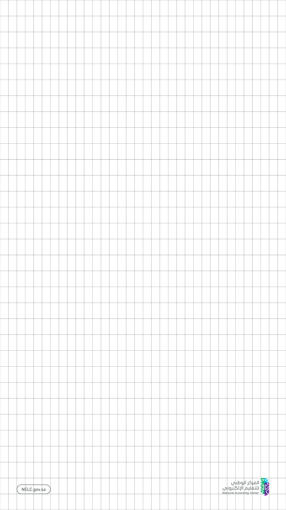
  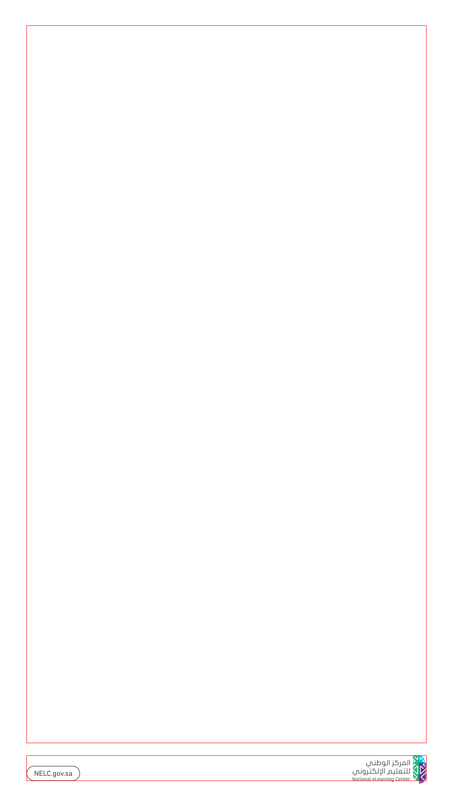
  

---

## Usage

Use these assets and templates to maintain consistent visual output across campaigns, communication materials, and digital platforms.

---

## Structure

- branding/  
- Components/  
- Foundations/  
- Templates/  
